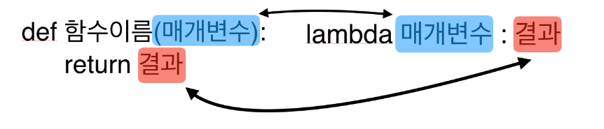

# 람다 함수(익명함수)

당장 쓰고 버리는 함수를 만들때 사용하는 것으로 메모리를 효율적으로 사용하기 위해 사용된다.





- 결과를 `return` 키워드 없이 자동으로 `return`해준다.


- lambda 함수는 함수의 이름을 정하지 않는다.

```
>>> (lambda x : x+1)(5)
6
```


```
>>> func = lambda x : x + 1
>>> func(5)
6
```


### map() 함수 이용

```
>>> a = [1, 2, 3, 4]
>>> b = [5, 6, 7, 8]
>>> list(map(lambda x, y: x+y, a, b))
[6, 8, 10, 12]
```


### filter() 함수 이용

```
>>> odd = [1, 2, 3, 4, 5]
>>> list(filter(lambda x:x%2 == 1, odd))
[1, 3, 5]
```


### reduce() 함수 이용

```
>>> from functools import reduce
>>> reduce(lambda x, y: x+y, [1, 2, 3, 4, 5])
15
```


-----

참고


https://offbyone.tistory.com/73

https://wayhome25.github.io/cs/2017/04/03/cs-03/

https://soooprmx.com/archives/8774


