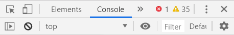
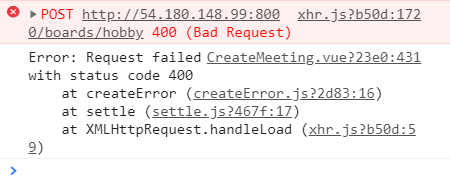
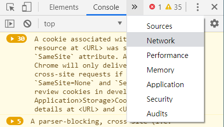
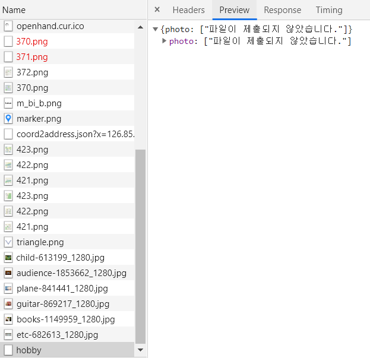
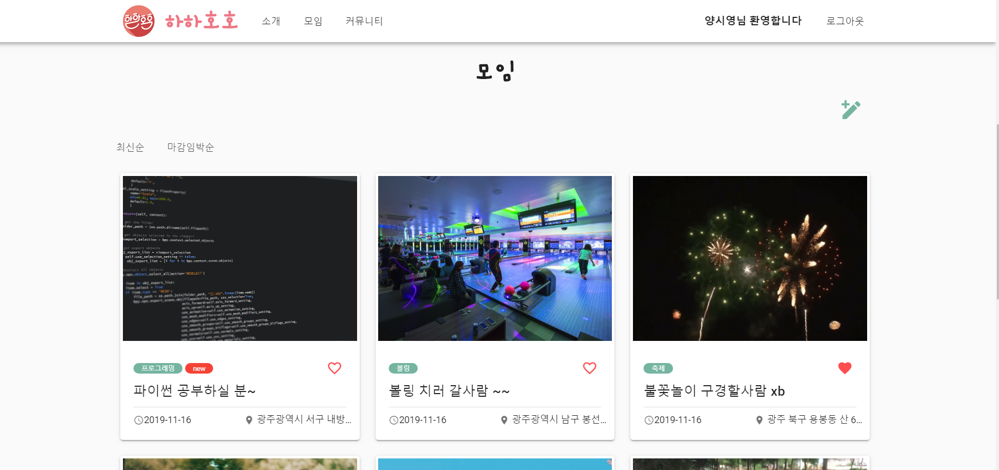

# 400 에러 해결 하기

> DRF를 이용하여 vue와 axios api호출을 하였다. 
>
> 그런데 계속 400에러가 발생했고 그 이유와 해결방법을 찾지 못해 고생하였다. 
>
> 많이 알진 못하지만 내가 해결한 과정과 방법만 이라도 미래의 나에게 혹은 누군가에게 도움이 되길 바라며 기록해 둔다.

 

우선 400 Error가 무엇인지 찾아보자.

Bad Request, 요청 실패

문법상 오류가 있어서 서버가 요청 사항을 이해하지 못함. 

서버가 클라이언트 오류(예: 잘못된 요청 구문, 유효하지 않은 요청 메시지 프레이밍, 또는 변조된 요청 라우팅) 를 감지해 요청을 처리할 수 없거나, 하지 않는다는 것을 의미한다.

즉 요청을 보내는데 있어서 문제 있는 것 이다.

 

## 해결 과정

- 크롬의 개발자 도구를 이용해서 에러를 확인한다.

 

- 400 Bad Request 가 발생했다.

 

- 에러에 대한 정보를 확안하기 위해 Network 로 이동하다.

 

- 빨간색으로 에러가 표시된 것을 클릭하면 옆에 Preview에 어떠한 파라미터에 문제가 있는지 확인할 수 있다.

 

- 위의 파라미터를 수정하면 아래와 같이 글 작성이 제대로 된것을 확인 할 수 있다.

 

> 400 에러가 특별히 어려운 에러는 아니다.
>
> 
>
> 하지만 이유를  제대로 모른채로 400에러가 난것만 확인하면 코드를 수정하는데 시간이 많이 소모된다.
>
> 
>
> 알면 쉽지만 모르면 너무 어려운 400 에러 였다. 

