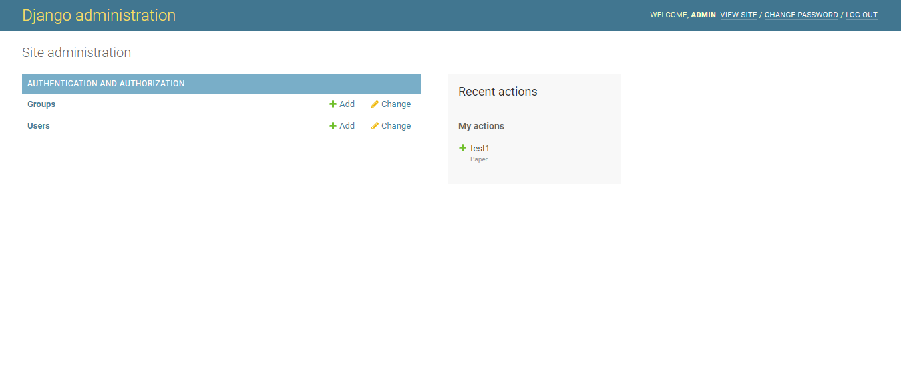
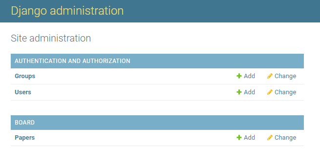
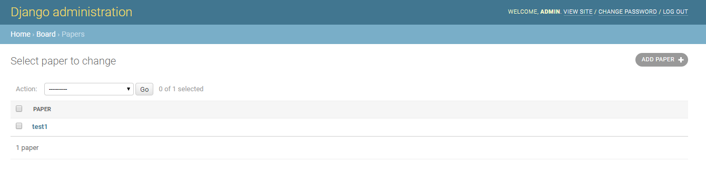
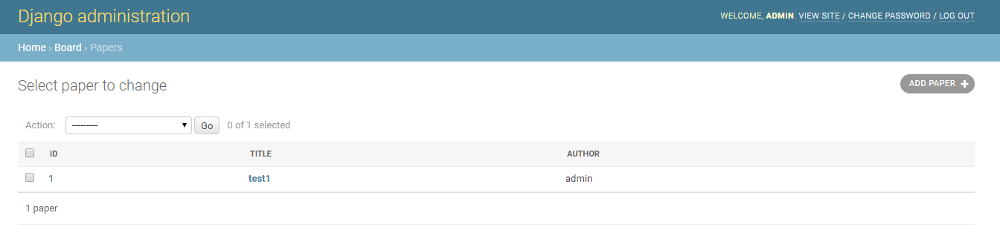
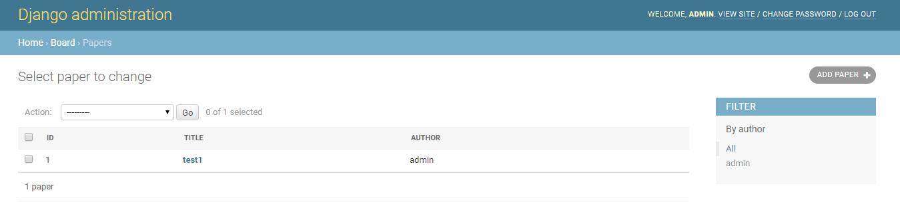
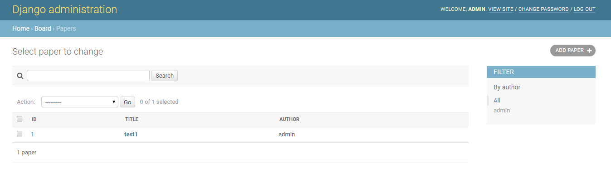

# Django admin site 커스텀하기

<br/>

> Django의 장점 중에 하나인 관리자(admin) 페이지를 더 잘 사용하기 위해서
>
> admin.py 를 커스터마이즈 해보자!
>
> 다양한 기능이 있지만 우선 내가 사용해본 것 위주로 작성했다.
>
> 
>
> Django의 기본 사용과 model 작성 관련 부분은 생략했다.

<br/>

- Model 등록하기 전



<br/>

## Model을 admin site에 등록하는 방법

### 첫번째 방법

- 기본 `ModelAdmin`을 이용해서 admin페이지에 등록한다.

```python
# admin.py
from django.contrib import admin
from .models import Paper

admin.site.register(Paper)
```


<br/>

### 두번째 방법

- 데코레이터를 이용하여 admin페이지에 등록한다.

```python
# admin.py
from django.contrib import admin
from .models import Paper

@admin.register(Paper)
class PaperAdmin(admin.ModelAdmin):
    ...
```




<br/>




<br/>

## 추가 기능들

### list_display

- 기본적으로는 하나의 오브젝트에 하나의 값만 나타낸다.
- 하나의 오브젝트에 여러 값을 표시하기 위해서 `list_display`를 사용한다.


```python
# admin.py
from django.contrib import admin
from .models import Paper

@admin.register(Paper)
class PaperAdmin(admin.ModelAdmin):
    list_display = ['id', 'title', 'author']
```


- 한줄에 id, title 과 author이 나타나도록 한다. 


<br/>

### list_display_links

- admin site에서 세부 항목으로 들어가는 link를 임의로 설정 할 수 있다.
- link를 설정하지 않을 경우 맨 앞에 자동으로 link가 달린다.


```python
# admin.py
from django.contrib import admin
from .models import Paper

@admin.register(Paper)
class PaperAdmin(admin.ModelAdmin):
    list_display = ['id', 'title', 'author']
    list_display_links = ['title']
```


- title에 link를 설정해 주었다.




<br/>

### list_filter

- admin site 오른쪽에 있는 UI를 통해서 원하는 값만 filtering 할 수 있다.


```python
# admin.py
from django.contrib import admin
from .models import Paper

@admin.register(Paper)
class PaperAdmin(admin.ModelAdmin):
    list_display = ['id', 'title', 'author']
    list_display_links = ['title']
    list_filter = ['author']
```


- author를 기준으로 filtering 했다.




<br/>

### search_fields

- admin site에서 검색UI를 이용하여 원하는 데이터를 검색 할 수 있다.


```python
# admin.py
from django.contrib import admin
from .models import Paper

@admin.register(Paper)
class PaperAdmin(admin.ModelAdmin):
    list_display = ['id', 'title', 'author']
    list_display_links = ['title']
    list_filter = ['author']
    search_fields = ['title']
```


- title를 기준으로 검색을 하여 원하는 데이터를 찾는다.




<br/>

> 이외에도 다른 기능들이 있지만 아직 써보지 않아서 모르겠다.
>
> 우선은 Django의 admin site에 다양한 기능이 있다는 것을 알고 
>
> 필요하면 검색을 해보는게 중요할꺼 같다.


<br/>

## 테마 적용하기

### Suit

- Admin site에 테마를 적용하면 간단하게  꾸밀 수 있다.


- 설치

```
pip install django-suit
```


> django-suit에 대해서는 나중에 따로 글을 작성하겠다.
>
> 하지만, 쉬우니 그냥 구글링을 추천하겠다.


<br/><br/><br/>

-----------------

### Reference

[Django admin cook book](http://books.agiliq.com/projects/django-admin-cookbook/en/latest/index.html)

[Django-admin 관련 Blog](https://ssungkang.tistory.com/entry/Django-admin-페이지-효율적으로-다루기)

[Django admin 관련 ppt](https://www.slideshare.net/bbayoung7849/djangoadminsitecustomexample)