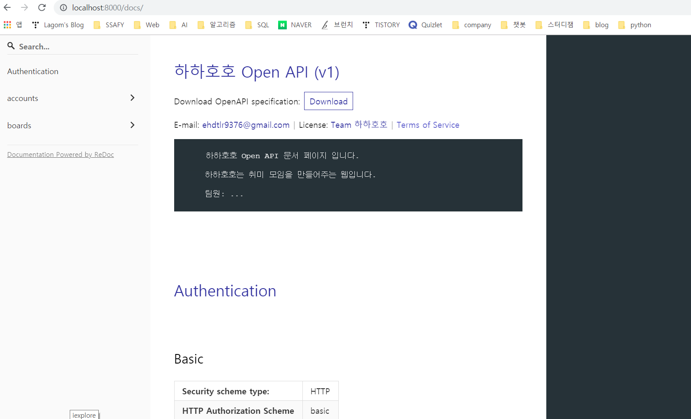
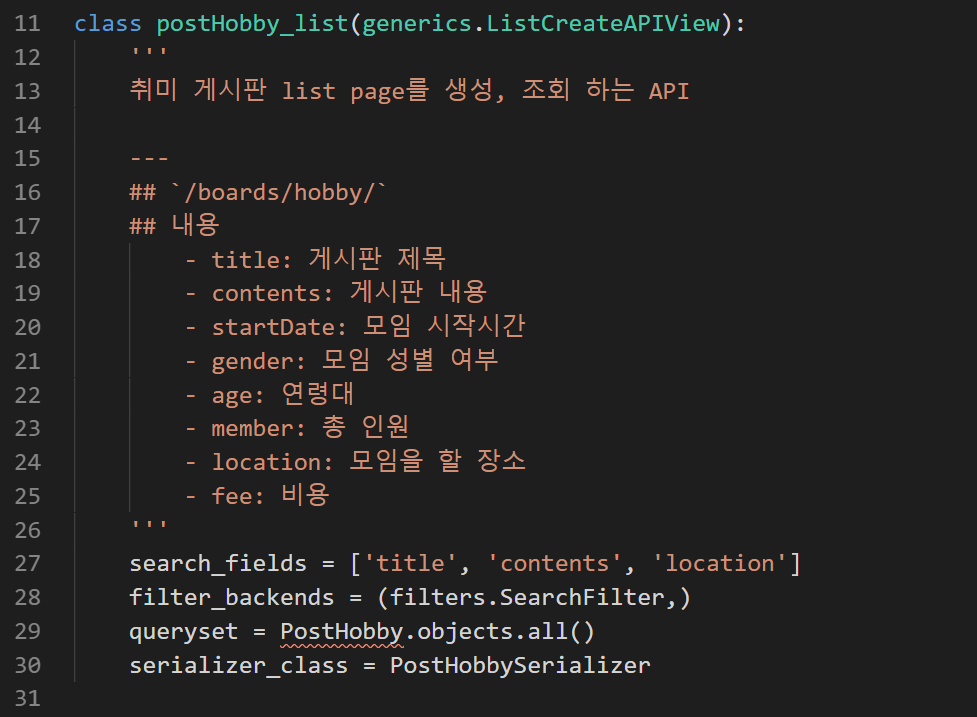
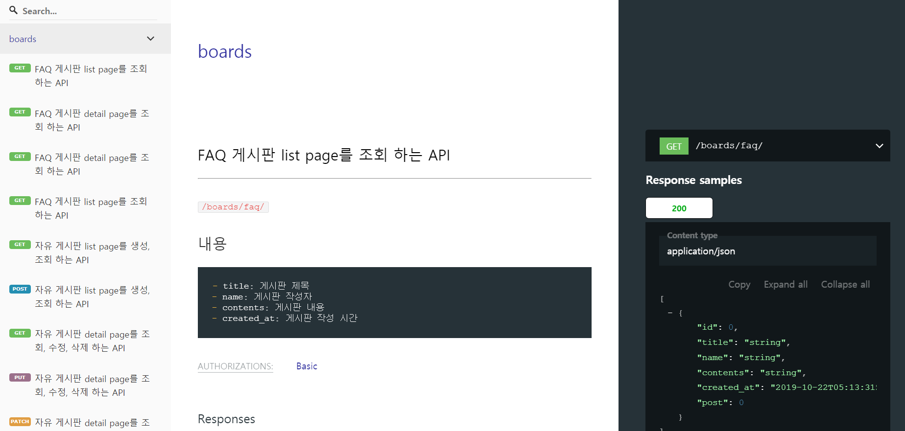

# drf-yasg


django restapi를 문서화 하자!


- Install

```
pip install -U drf-yasg
```

```
pip install flex
```


- settings.py에  APP추가

```
INSTALLED_APPS = [
	...
	'drf_yasg',
]
```


- yasg.py 생성 후 내용 입력
- urls.py에 바로 넣어도 되지만 urls.py에 내용이 너무 길어지기 때문에 분리 시켰다.

```
from django.conf.urls import url
from django.urls import path, include
from drf_yasg.views import get_schema_view
from rest_framework.permissions import AllowAny, IsAuthenticated, BasePermission
from drf_yasg import openapi

schema_url_patterns = [
    path('boards/', include('boards.urls')),
]
 
schema_view = get_schema_view(
    openapi.Info(
        title="하하호호 Open API",
        default_version='v1',
        description = 
        '''
        하하호호 Open API 문서 페이지 입니다.

        하하호호는 취미 모임을 만들어주는 웹입니다.
        
        팀원: ...
        ''',
        terms_of_service="https://www.google.com/policies/terms/",
        contact=openapi.Contact(email="ehdtlr9376@gmail.com"),
        license=openapi.License(name="Team 하하호호"),
    ),
    validators=['flex'],
    public=True,
    permission_classes=(AllowAny,),
    patterns=schema_url_patterns,
)
```


- urls.py 에 내용추가

```
from .yasg import *

urlpatterns = [
    ...
    
    path('swagger<str:format>', schema_view.without_ui(cache_timeout=0), name='schema-json'),
    path('swagger/', schema_view.with_ui('swagger', cache_timeout=0), name='schema-swagger-ui'),
    path('docs/', schema_view.with_ui('redoc', cache_timeout=0), name='schema-redoc'),
]
```


- 실행 화면

`/doc/` 에 접속하면

api 예시




- Custom
- 타이틀과 API설명들 추가하기 
- 예시




- Custom 
- 결과 예시




---------------

참고

https://jay-ji.tistory.com/31

https://gaussian37.github.io/python-rest-drf-yasg/

https://github.com/axnsan12/drf-yasg#id6